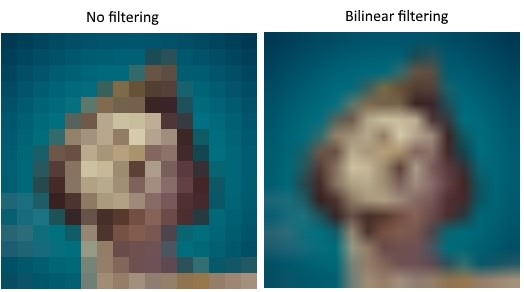
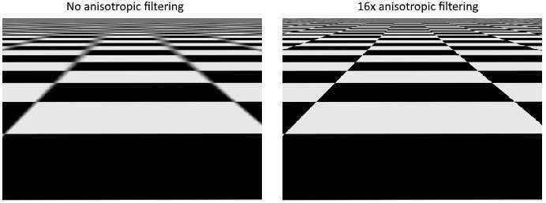
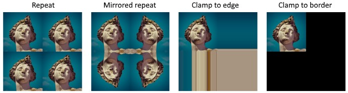

# Texture Mapping and images in Vulkan

We are moving on in this project to a point where we would like textures to be mapped onto geometry.
Understandably, this is not a single function call.
We need to put several things into place for us to do this.

1. We need to have the image data on the device and *in a layout that works well for texturing*
	- This is comprised of several substeps:
		1. We need to load an image from disk into CPU memory.
		2. We need to use a staging buffer to copy data from CPU to device.
		3. We free the CPU memory used for the image once it's in the CPU visible and CPU coherent memory.
		4. We create a Vulkan Image object with which we will associate device local memory.
		4. Transition the memory associated with the image to be optimal for usage as a destination
		5. Copy the image data from the staging buffer to the image buffer
2. We need to have an view of the created vulkan image and a sampler that is defined to work with images in a way that we want.
	- This has the steps of:
		1. Create an image view
		1. Create an image sampler 
3. We finally need to add descriptors that link to the shaders, and then we need to add UV coordinates to our vertex input.
		
## Vulkan Images

Vulkan images are similar to buffers in many ways. 
They are handles to objects that have a section of device memory assigned to them.
They differ from buffers in that they can have many different layouts of their data depending on how they are intended to be used.
We have already seen this earlier with the PRESENT OPTIMAL KHR layout for our swap chain.
For loading our image into CPU memory we use stb image, which is an open source library.

As stated above, our steps for loading in our texture image is as follows: 

1. We need to load an image from disk into CPU memory.
2. We need to use a staging buffer to copy data from CPU to device.
3. We free the CPU memory used for the image once it's in the CPU visible and CPU coherent memory.
4. We create a Vulkan Image object with which we will associate device local memory.
4. Transition the memory associated with the image to be optimal for usage as a destination
5. Copy the image data from the staging buffer to the image buffer

### Preparing the image

Loading the image into CPU memory and copying the data to a staging buffer is straight forward.
Nothing about it is different than doing the same for any of our other data thus far.

So where do the differences begin? In our creation of the vulkan image and its associated memory.

#### Vulkan Image Creation

Unsurprisingly, we will need a class memory that stores the handle to the image, and another member to store the handle to the device memory associated with that image.
Also unsurprisingly, creating an image handle requires filling out a `VkImageCreateInfo` structure and making a similar call to create.

The fields of importance for this structure are:

- image type: is it 2D/3D/something else?
- image extent: subdivided into height, width, and depth
- mip levels: are we using mip mapping?
- array layers: is the texture an array?
- format: what data format are the texels to be stored as?
- tiling: are we storing data as though it were a 2d array? or are we storing it to be optimal for tiling?
- initialLayout: is the initial data in such a way that it can be preserved? or do we not care?
- usage: what operations will be performed on the memory associated with this image?
- samples: how many samples are there for multisampling?
- flags: is this a sparse image of some variety?

Before we pat ourselves on the back, we need some memory allocated that will meet the requirements that this image has.
`vkGetImageMemoryRequirements(device, textureImage, &memRequirements);` will tell us what we need precisely.
`VkMemoryAllocateInfo` and a call to `vkAllocateMemory(device, &allocInfo, nullptr, &textureImageMemory)` will give us what we need.
Finally, we need to tell the API that this memory is for this particular image: `vkBindImageMemory(device, textureImage, textureImageMemory, 0);`

#### Copying Staging Buffer Data to an Image

Unfortunately, you cannot just do a buffer copy command and pretend that magic will happen that makes the copied data be in the right format.
If only.
Instead we need to explicitly tell the API to transition the memory associated with the image to be optimal for receiving data.
That's not all! 
Since everything is asynchronous, we will also need to create a pipeline barrier that prevents operations being performed on the image until the transition is complete.
Unsurprisingly, we will use a command buffer to record all of this, and submit the buffer to the graphics queue.

##### The Memory Barrier

We begin by defining a `VkImageMemoryBarrier` structure. 
This structure has the following important fields defined:

- oldLayout: The layout being transferred from
- newLayout: The layout being transferred to 
- srcQueueFamilyIndex: the queue families that currently own the image
- dstQueueFamilyIndex: the queue families that are to become the owners
- image: the image handle we are defining a barrier for
- subresourceRange: The sub-parts of the image that we are defining a barrier for
	- aspectMask: ASPECT_COLOR_BIT in our case
	- baseMipLevel:
	- baseArrayLayer
	- layerCount
- srcAccessMask: The operations that involve the resource that must happen before the barrier
- dstAccessMask: The operations that must wait on the barrier

How to define the stages that are being used? Unfortunately, there is no way to do this automagically.
It explicitly depends on what you are trying to do.

If our case:
```objectivec
if (oldLayout == VK_IMAGE_LAYOUT_UNDEFINED && newLayout == VK_IMAGE_LAYOUT_TRANSFER_DST_OPTIMAL) {
    barrier.srcAccessMask = 0;
    barrier.dstAccessMask = VK_ACCESS_TRANSFER_WRITE_BIT;

    sourceStage = VK_PIPELINE_STAGE_TOP_OF_PIPE_BIT;
    destinationStage = VK_PIPELINE_STAGE_TRANSFER_BIT;
} else if (oldLayout == VK_IMAGE_LAYOUT_TRANSFER_DST_OPTIMAL && newLayout == VK_IMAGE_LAYOUT_SHADER_READ_ONLY_OPTIMAL) {
    barrier.srcAccessMask = VK_ACCESS_TRANSFER_WRITE_BIT;
    barrier.dstAccessMask = VK_ACCESS_SHADER_READ_BIT;

    sourceStage = VK_PIPELINE_STAGE_TRANSFER_BIT;
    destinationStage = VK_PIPELINE_STAGE_FRAGMENT_SHADER_BIT;
} else {
    throw std::invalid_argument("unsupported layout transition!");
}
```

The barrier is then defined by a call to `vkCmdPipelineBarrier(commandBuffer,sourceStage, destStage,0,0, nullptr,0, nullptr,1, &barrier);`.
The third parameter is whether or not data can be read from written regions while processes are still ongoing.
The last three parameter pairs are arrays of the three different kind of barriers there are.

#### Image Copying

Even with the image being specified to be receive data, we still can't just do a 1-1 copy from the buffer.
Instead we need to define a `VkBufferImageCopy` structure that tells the API, **how** you want the copy to be done.

The important fields on this structure:

- bufferOffset: offset into the buffer to copy FROM
- bufferRowLength: used when you have to pad for alignment purposes, otherwise 0 for tightly packed
- bufferImageHeight: same purpose as RowLength
- imageSubresource: contains the same values as before. Just specifies what part of the image object we are copying **into**
- imageExtent: simple structure of width, height, depth

Now it's just a call to `vkCmdCopyBufferToImage(commandBuffer,buffer,image,VK_IMAGE_LAYOUT_TRANSFER_DST_OPTIMAL,1,&region);`.

Just in case it wasn't already obvious, we need to record these calls into a command buffer and submit it to the graphics family queue.

FUCKING FINALLY, we transfer the image layout **back** to SHADER READ ONLY OPTIMAL since we are sampling from it.

## Image Views and Image Samplers

### Image Views

We have already used image views for our swap chain, but I will briefly review them here as we will need another view that is connected to our image.
The view create info has the following fields:
- image source handle
- view type of that image
- format of that image
- the subresource ranges of the image handle which we view

### Image Samplers

Image samplers are objects that define how values can be sampled from an image. (What a surprise!)
What this means is that the sampler defines the behaviors for how values are returned from an image.
The sampler will apply filtering and transformations based on the desired behaviors.

This is useful for many many things.
For instance, the image sampler can interpolate the color value based on the position of a fragment.
So if you have more fragments than texels, it will interpolate between the values.



If you have fewer fragments than texels, you can end up with artifacts and bluring when sampling high frequency patterns viewed at a sharp angle:



This can be resolved with anisotropic filtering.

As for transformations, a sampler can do things such as resolving the color returned when a chosen index is out of range of the actual image.



The sampler can also be configured what color to return if clamp to border is chosen.
The chosen methodology here is called the `addressMode`.

The `VkSamplerCreateInfo` that you predictably have to fill out for configuring a sampler has the following members:
- mag/minFilter: (How to filter when texels are magnified or minified)
- addressMode(u/v/w): how to handle OOB coordinates for the image.
- anisotropyEnable/maxAnisotropy: values to configure an anisotropic filter.
- borderColor: used to determine return color for OOB values and clamped address.
- compareEnable/compareOp: values to configure a comparison operation which will be used to filter out coordinates
- unnormalizedCoordinate: boolean which states whether coordinates are between 0 and image extent, or between 0 and 1.
- mipmapMode/miLodBias/minLod/maxLod: values to configure mipmapping.

Of note: When choosing anisotropic filtering, this is a device filter and you need to enable this filter when creating your logical device.
Most devices will have this feature, but not all, so possibly consider having some conditional logic for handling the event that you can't have anisotropic filtering.

## Linking to Shaders

Now that we have our sampler, our image, and our image view, we can finally add the descriptors which will link our objects to the shaders.

We first need to add a new layout for our sampler, giving it a unique binding.
We are choosing COMBINED IMAGE SAMPLER for our descriptor type, and we are making it accessable from the fragment stage.
We add this layout to our descriptor SET layout structure.

Next, we need to add a pool size for this new descriptor, and add it to the descriptor pool create info.

Finally, we add a `VkDescriptorImageInfo` structure to our update portion of `createDescriptorSets()`.
This info is what links our VIEW to our SAMPLER.
In addition, it specifies the image layout that we request for this descriptor.
In our case: SHADER READ ONLY OPTIMAL.

These descriptor sets match the number of images in our swap chain because once again, we don't want to change information while that information is being read.

### Updating vertex input and Shaders

We need to add our UV coordinate information to our vertexes as that is a needed part for textures to work.
UV coordinates are what map a particular geometric position with a texture coordinate.
These get interpolated in our fragment stage, so that's nice.
Next up, we add our sampler as a binding to our fragment shader.

In the fragment shader, we call the texture function, passing it the sampler, and the UV coordinate.
By manipulating this coordinate in our fragment shader, we can scale how our texture is mapped, how it blends with the vertex buffer and other fun things.

Not too shabby!
