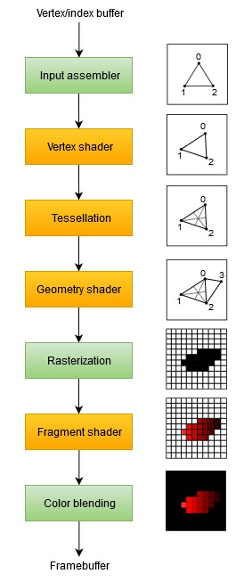
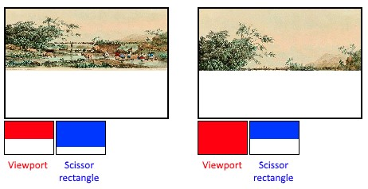

# Graphics Pipeline Setup and Overview

This is by far the most involved section. Lets begin with the overall structure of the pipeline:



Each of these stages has their own necessary configurations. Because of this, the approach taken to create the pipeline is thus:

1. Create the shader modules, and then stick them in an array.
2. Configure the fixed function stages.
3. Create a render pass object.
4. Use all of the previously created objects to create the pipeline object.

## Shader Modules

There are four general types of shaders that are used: vertex, tessellation, geometry, and fragment.
Because of liberal interpretations of the GLSL language, there were possible incompatibilities and eccentricities from various compiler implementors.
Therefore, for Vulkan, shaders must be compiled to an intermediary language called SPIR-V.
`glslangValidator.exe` which comes with the Vulkan SDK, is used to validate and compile the shaders.

All shaders share the following features:
- Layout.
	- Used for determining input and output locations into various buffers.
- Datatypes. _i.e._ `vec(1-4), mat(1,4)`
	- Used for representing things like the MVP matrix, colors, positions, vectors, etc...
- Compilation
	- All shaders for vulkan need to be compiled into SPIR-V before it can be accepted.
	- The output intermediary code is then read into the program in a binary format and given to the various api functions.

### Vertex Shader

This shader is responsible for taking incoming vertices (*generally world coordinates*) and applying various transforms to them.
Regardless of the transforms applied to the vertices, the output is expected to be the final position in clip coordinates and needed attributes for the other shaders that must be passed on.
The **clip coordinates** are transformed into **normalized device coordinates** by the dividing the vector by the *w* component.

Common Inputs:
- world position
- color
- normal
- texture coordinates

Built-In Variables:
- `gl_VertexIndex`: contains the index of the current vertex
- `gl_Position`: functions as the output

### Fragment Shader

When the vertices are eventually passed through the rasterizer fixed function stage, what is output are called fragments.
These fragments could be considered "candidate pixels".
The fragment shaders responsibility is to then output the resulting color of the given fragment (among other things).
 
#### Loading Shaders

Loading a shader is not too difficult. 
Just open up an `ifstream` in binary mode and read it into a vector.
Bonus points for opening at the end and using `tellg` for getting the \# of bytes in the file.
Once you have the bytes, hand it and their size off to a `VkShaderModuleCreateInfo` structure.
Using the structure, it's merely a call to `vkCreateShaderModule` that follows the same pattern as the rest of the api.
Just remember that because we've done a call to "create", we will need a corresponding "destroy".
Shader modules don't need to live beyond the creation of the pipeline.

### Giving Shaders to the Pipeline

Just because you have the modules, it doesn't meant that you have what you need for the pipeline.
Instead, you need to provide the pipeline with a `VkPipelineShaderStageCreateInfo` structure.
Thankfully, it's very straightforward to populate these.

Of note: `pName` corresponds to the name of the method in the shader which you would like to be the "entry-point".

Also of note: `pSpecializationInfo` is used for specifying constants for your given shader. 
This can be used to configure the shader for a particular behavior and potentially optimize the code as the compiler will automatically remove unnecessary `if` statements.

The pipeline will expect a `VkPipelineShaderStageCreateInfo` **array**, so be sure to set one up with the shaders that you have.

### Setting up Uniform Values for Shaders

The pipeline is responsible for the creation of uniform values, therefore if needs to know your layouts and other data.
Since the program thus far has no uniform values, there isn't much to do, but we still need to create a `VkPipelineLayoutCreateInfo` structure.
When there are uniform values, there will be a need to reference the layout, so it is prudent to add a `VkPipelineLayout` member to the class.
The create info structure is populated with zeros and `nullptr`s, and after a call to `vkCreatePipelineLayout`, we have our `PipelineLayout` handle.

In keeping with tradition, our call to `create` requires a corresponding `destroy`, so make sure to add a call to `vkDestroyPipelineLayout` in your cleanup function.

## Fixed Function Stages

In other APIs, these are configured automatically for you. 
No such handholding is to be found in Vulkan.
Instead, it's up to you to explicitly state exactly how you wish the fixed function stages to operate.

This translates to you needing to configure:
1. The Input Assembler
	- Vertex Input
	- Input Assembly
	- Viewports and Scissors
2. The Rasterizer
	- Multisampling
	- Depth and Stencil Testing
3. Color Blending
4. Possible Dynamic States

### Input Assembler

This stage is comprised of roughly three different parts:
1. The Vertex Input
2. Input Assembly
3. Viewports and Scissors

#### Vertex Input

`VkPipelineVertexInputStateCreateInfo` is what needs to be configured here.
It describes the format of the vertex data that will be passed to the vertex shader.

This description includes two parts:
- Bindings: spacing between data and if the data is per-vertex or per-instance
- Attribute descriptions: type of the attributes passed on, which binding to load them from, and at which offset

Since this initial phase of the project has no bindings or attributes, the population of the structure is trivial.

#### Input Assembly

`VkPipelineInputAssemblyStateCreateInfo` appropriately corresponds to the input assembly. 
This is responsible for describing what kind of topology is to be drawn, and if a primitive restart is to be enabled.

Topology is self explanatory, so here is a list of accepted values: 
`VK_PRIMITIVE_TOPOLOGY_POINT_LIST`, 
`VK_PRIMITIVE_TOPOLOGY_LINE_LIST`, 
`VK_PRIMITIVE_TOPOLOGY_LINE_STRIP`, 
`VK_PRIMITIVE_TOPOLOGY_TRIANGLE_LIST`, 
`VK_PRIMITIVE_TOPOLOGY_TRIANGLE_STRIP`

Primitive restart allows for the breakup of strip topologies using special values like: `0xFFFF`

Of note: vertices are loaded from the vertex buffer and are usually indexed in sequential order, but using an `element buffer`, one can explicitly specify indices to use.

#### Viewports and Scissors

A viewport basically describes the region of the framebuffer that the output will be rendered to. 
This will almost always be `(0, 0)` to `(width, height)`. 
Remember that you need to get these width and height values from the swapChainExtent, and not the window.

`VkViewport` is where this information is configured.
For min/max depth, unless you're doing something special, stick to values: `0.0, 1.0`.

`VkRect2D` is what is used to describe scissors.
Scissors define the regions of the framebuffer where pixels will actually be stored.
For this project, we are doing nothing special, so set this to the swapChainExtent.

A good visual for the differences here:

   

**Finally**, this information is handed off to the pipeline through a `VkPipelineViewportStateCreateInfo` structure.
Multiple viewports and scissors can be used, ***but*** this is a feature that must be enabled when creating your device.

### Rasterizer

> The rasterizer takes the geometry that is shaped by the vertices from the vertex shader and turns it into fragments to be colored by the fragment shader. 
> It also performs depth testing, face culling and the scissor test, and it can be configured to output fragments that fill entire polygons or just the edges (wireframe rendering).
> All this is configured using the `VkPipelineRasterizationStateCreateInfo` structure.

`VkPipelineRasterizationStateCreateInfo` Properties:
- depthClampEnable: If depth values are out of bounds, instead of discarding the fragments, they are clamped to the values.
- polygonMode: determines how fragments are generated from vertices. 
If not FILL/LINE/POINT, then you need to enable additional GPU features.
- lineWidth: If val > 1.0, then you need to enable another GPU feature.
- cullMode: what z-values result in a cull
- frontFace: Clockwise or Counterclockwise RHR for determining what is considered "front".
- depthBias(Enable/ConstantFactor,Clamp,SlopeFactor): used for shadow mapping generally.

#### Multisampling

> The `VkPipelineMultisampleStateCreateInfo` struct configures multisampling, which is one of the ways to perform anti-aliasing.
> It works by combining the fragment shader results of multiple polygons that rasterize to the same pixel.
> This mainly occurs along edges, which is also where the most noticeable aliasing artifacts occur.
> Because it doesn't need to run the fragment shader multiple times if only one polygon maps to a pixel, it is significantly less expensive than simply rendering to a higher resolution and then downscaling.
> Enabling it requires enabling a GPU feature.

For now, this state is required, but disabled.

#### Depth and Stencil Testing

If you're using one of the appropriate buffers, you'll need to use a `VkPipelineDepthStencilStateCreateInfo` to specify the information.
This project is not yet using these features and so this is also disabled. `nullptr` will be passed instead of this object.

### Color Blending

This stage describes how the colors to be rendered should be combined with the colors already present in the framebuffer.
There are two ways of doing this:

1. Mix the old and new value to produce the output
2. Combine the old and new value using a bitwise operation

In addition, there are two types of structs to configure this blending operation:

1. `VkPipelineColorBlendAttachmentState`
	- This is the configuration per attached framebuffer.
2. `VkPipelineColorBlendStateCreateInfo`
	- This is the *global* color blending configuration.
	- References the array of structures for all of the framebuffers and allows you to set blend constants that you can use as blend factors.
	
The blending operation could generally be described using the following pseudocode:

```objectivec
 if (blendEnable) {
     finalColor.rgb = (srcColorBlendFactor * newColor.rgb) <colorBlendOp> (dstColorBlendFactor * oldColor.rgb);
     finalColor.a = (srcAlphaBlendFactor * newColor.a) <alphaBlendOp> (dstAlphaBlendFactor * oldColor.a);
 } else {
     finalColor = newColor;
 }
 finalColor = finalColor & colorWriteMask;
```

### Dynamic State

For all of these fixed function configurations, there is a limited amount of state that *can* be changed without recreating the whole pipeline.
If you wish to take advantage of this, you need to fill in a `VkPipelineDynamicStateCreateInfo` structure.
You specify the dynamic values through an array of `VkDynamicState` which is passed to the struct.
Taking advantage of this will cause the values to be ignored until draw time at which point you are required to specify the values.

## Creating The Render Pass

Before the pipeline can be created, we need to tell vulkan abut the framebuffer attachments that will be used while rendering.
This means specifying hoow many color and depth buffers there will be, how many samples to use for each of them and how their contents should be handlled throughout the rendering operations.
All of this information is wrapped in a `render pass` object.

For this project, we will only have a single color attachment.
This attachment is represented by one of the im,ages from the swap chain.
This is descripbed by a `VkAttachmentDescription`. 

Again, in our case, the format should match that of our swapchain, and since we are not doing multisamplig, our samples count is one.
The load operation and store operation describes how we wish to store and clear the data in the image..
Load has the options of: clear, load, and dont care.
Store has the options of: store and dont care.

If we were using a stencil operation, would could also describe the stencils load annd store operations.
For now though, we specify dont care. 

Since textures and framebuffers are represented by vkimage objects, the layout of pixels can changed based on what you're trying to do with it.
Therefore, we must specify the initial and final layouts our attachment will have.
Options include: undefined, optimal, presentsrckhr, and others..

### Subpasses and Attachment References

A single render pass can consist of mulltiple subpasses.
Subpasses are subsequent rendering operations that depend on the contents of framebuffers in previous passes..
By groupig these rendering operations together in a single pass, Vulkan is able too reorder operations to better optimize memory and improve performance.
Subpasses will use one or more attachments, and therefoer will need a reference to the attachment. 

References to attachments are described using a `VkAttachmentReference` structure.
This specifies the layout of the attachment, and the index of this attachment, in the attachments array.
In our case, we only have one attachment that is a color attachment, so `VK_IMAGE_LAYOUT_COLOR_ATTACHMENT_OPTIMAL` is used for best performance.

Subpasses themselves are described using a `VkSubpassDescription` structure.
`piplineBindPoit` tells Vulkan what type of subpass to expect.
While there is only `GRAPHICS` right now, there may be compute subpasses in the future.
Next, we specify the color attachments that are associated by giving a size and a pointer.
**The index of this attachment is what is specified by the `layout(location = 0) ...` directive in our shaders.**
Subpasses can also reference input, resolve, deppthstencil, and preserve attachments.

### Render Pass

**Finally** we can create our render pass object!
It is important to keep a reference to our render object; not only for operations, but also to clean it up at the end.
Hopefully surprising no one at this point, we specify the attributes of our render pass using a `VkRenderPassCreateInfo` structure.
This structure is what takes our array of attachments, and our array of subpasses which consume these attachments.
At this point, we only require a call to `vkCreateRenderPass` and we're golden.

## Pipeline Object

**Finally** we're at the point where we bundle everything together and get our magnificent pipeline object!
Unsurprisingly, this object will tie together our shader stages, fixed function configurations, and our render pass description.
To do so, we need to populate a `VkGraphicPipelineCreateInfo` structure.

`VkGraphicPipelineCreateInfo` important fields:
- stageCount, pStages: our shader stages consumed as an array.
- pVertexInputState, pInputAssemblyState, pViewportState, pRasterizationState, pMultisampleState, pDepthStencilState, pColorBlendState, pDynamicState
	- These fields describe our fixed function configurations. 
- pipelineLayout: this describes our uniform values and buffers.
	- This is passed as a vulkan handle and not a pointer.
- renderPass, subpass: this is our handle to the render pass, and the beginning index of the subpass to use.
	- Note: we can use other render passes with this pipeline, but they *must* be compatible with it.
- basePipelineHandle, basePipelineIndex: it is possible to create pipelines by deriving from an existing pipeline.

Once we have the needed information filled out, we only require a call to `vkCreateGraphicsPipeline` to get our pipeline.
Don't forget to keep a handle to this pipeline as it will need to be destroyed when we clean up.

Finally of note: You can use a `VkPipelineCache` object to store and reuse data relevant to pipeline creation across multiple calls.
We aren't taking advantage of this yet as we only have one pipeline to worry about, but keep tis in mind.
